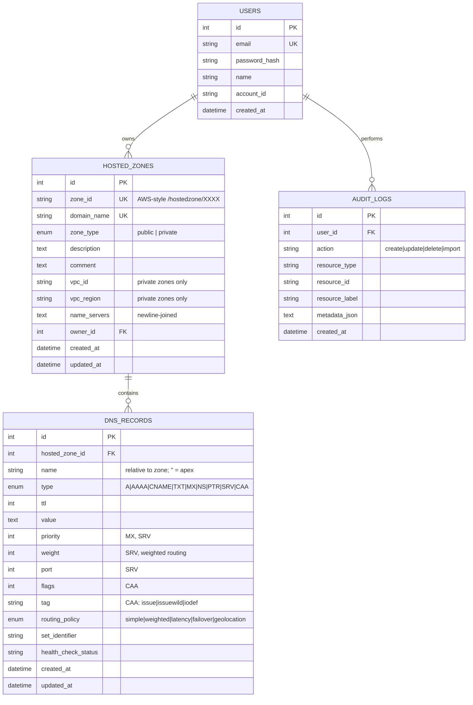

# Route 53 Console Clone

A production-quality full-stack clone of the **AWS Route 53 Console**, built with Next.js, FastAPI, SQLAlchemy, and SQLite.

> **Disclaimer:** This project is an educational clone and is not affiliated with or endorsed by Amazon Web Services. DNS operations are simulated and do not modify real DNS infrastructure.

---

## Live Demo

- **Frontend:** https://scaler-aws.vercel.app/
- **Backend API:** https://scaler-aws-u8tk.onrender.com/
- **API Documentation:** https://scaler-aws-u8tk.onrender.com/docs

---

## Features

### Route 53 Console
- AWS-inspired dashboard and navigation
- Hosted Zones management
- DNS Records management
- Global search
- Recent activity tracking
- Search, filtering, sorting, and pagination

### DNS Management
- Support for:
  - A
  - AAAA
  - CNAME
  - TXT
  - MX
  - NS
  - PTR
  - SRV
  - CAA
- Create, view, edit, and delete records
- Bulk record deletion
- BIND import
- JSON and BIND export

### User Experience
- Responsive AWS-style interface
- Dark mode
- Toast notifications
- Modal dialogs
- Keyboard shortcuts
- URL-synchronized search and filters
- Empty, loading, and error states

### Authentication
- Mock login/logout flow
- Session persistence
- HTTP-only session cookies
- Protected application routes

## Tech Stack

**Frontend:** Next.js 16 (App Router), React 19, TypeScript, Tailwind CSS v4, `lucide-react`

**Backend:** FastAPI, Pydantic v2, SQLAlchemy 2.0 (ORM), SQLite, pytest

**Authentication:** Mock authentication using PBKDF2-HMAC password hashing and HMAC-signed session tokens stored in `httpOnly` cookies. No real IAM/OAuth.

## Architecture

Both sides follow a layered, MVC-inspired architecture with a strict one-way dependency flow.

```mermaid
flowchart LR
    subgraph Frontend
        Pages["Pages / Routes (app/)"] --> Hooks["Feature hooks (features/*)"]
        Hooks --> Services["API client (services/api/*)"]
        Views["Reusable views (components/*)"] --> Pages
    end
    Services -- "fetch (same-origin, via Next.js rewrite)" --> Routes

    subgraph Backend
        Routes["API routes (api/routes/*)"] --> Controllers["Controllers (controllers/*)"]
        Controllers --> BizServices["Services (services/*)"]
        BizServices --> Repositories["Repositories (repositories/*)"]
        Repositories --> Models["Models (models/*)"]
        Models --> DB[(SQLite)]
    end
```



### Backend

The backend follows a strict layered architecture:

- **Routes** — Parse HTTP requests and delegate to controllers.
- **Controllers** — Orchestrate requests and manage successful transactions.
- **Services** — Contain business logic, validation, BIND processing, and audit logging.
- **Repositories** — Handle all SQLAlchemy queries, filtering, sorting, and pagination.
- **Models** — Define SQLAlchemy ORM entities and relationships.
- **Schemas** — Define Pydantic request/response contracts.

Expected domain errors are handled centrally through `AppError`, keeping HTTP concerns out of the business layer.

### Frontend

The frontend uses an MVC-inspired feature architecture:

- **`app/*`** — Thin Next.js route pages and layouts.
- **`features/*`** — Feature logic, hooks, tables, and dialogs.
- **`services/api/*`** — Typed API clients and centralized error handling.
- **`types/*`** — Shared TypeScript models.
- **`components/*`** — Reusable presentational UI components.

Components never call the API directly; all API communication goes through the typed API layer.

### Request Flow

```text
Next.js UI
    ↓
Feature Hooks
    ↓
Typed API Client
    ↓
FastAPI Routes
    ↓
Controllers
    ↓
Services
    ↓
Repositories
    ↓
SQLAlchemy ORM
    ↓
SQLite
```

## 📁 Folder Structure

```text
.
├── backend/
│   ├── app/
│   │   ├── main.py              # FastAPI app, CORS, handlers, routes
│   │   ├── core/                # Config, database, security, exceptions
│   │   ├── models/              # SQLAlchemy ORM models
│   │   ├── schemas/             # Pydantic request/response schemas
│   │   ├── repositories/        # Database queries and pagination
│   │   ├── services/            # Business logic and DNS operations
│   │   ├── controllers/         # HTTP operation orchestration
│   │   ├── api/routes/          # FastAPI route definitions
│   │   ├── utils/               # BIND parser and DNS utilities
│   │   └── seed.py              # Demo data seeding
│   └── tests/                   # Backend tests
│
├── frontend/
│   └── src/
│       ├── app/                 # Next.js routes and layouts
│       ├── features/            # Domain-specific logic and components
│       ├── components/          # Reusable UI components
│       ├── services/api/        # Typed API clients
│       ├── types/               # Shared TypeScript types
│       ├── hooks/               # Reusable React hooks
│       ├── constants/           # Navigation and DNS configuration
│       └── utils/               # Formatting and utility functions
│
├── docs/
│   └── architecture.md          # Detailed architecture documentation
├── docker-compose.yml
├── .env.example
└── README.md
```

## Database schema



**Indexes:** `hosted_zones.domain_name` (unique), `hosted_zones.zone_id` (unique), `dns_records(hosted_zone_id, name)` composite, `dns_records.type`, `dns_records.name`, `audit_logs(resource_type, resource_id)`, `audit_logs.created_at`.

**Cascading:** `dns_records.hosted_zone_id` has `ON DELETE CASCADE` (with SQLite `PRAGMA foreign_keys=ON` enabled per-connection so it's actually enforced) -- deleting a hosted zone deletes all of its records. `audit_logs.user_id` uses `ON DELETE SET NULL` so history survives user deletion.


## Authentication / demo credentials
```
Email:    admin@example.com
Password: Password123!
```

Authentication is intentionally mocked per the assignment scope: passwords are hashed with PBKDF2-HMAC and sessions are opaque, HMAC-signed tokens with a 12-hour expiry (see `backend/app/core/security.py`) -- there is no real IAM, OAuth, or MFA. The mock AWS account context (account ID `123456789012`, region "N. Virginia (us-east-1)") is fixed for the demo user.

## Local setup

Prerequisites: **Node.js 20+**, **Python 3.11+** (3.12 recommended for the widest prebuilt-wheel support), `pip`.

```bash
git clone https://github.com/yeswanthroy2007/scaler-aws-router53-clone.git
cd scaler-aws-router53-clone
```

## Environment Variables

Copy the example files:

```bash
cp backend/.env.example backend/.env
cp frontend/.env.example frontend/.env.local

## Running the backend

```bash
cd backend
python -m venv .venv
source .venv/bin/activate        # Windows: .venv\Scripts\activate
pip install -r requirements.txt

python -m app.seed               # create + seed the SQLite database
uvicorn app.main:app --reload --port 8000
```

The API is now at `http://localhost:8000` (docs at `/docs`).

Re-run `python -m app.seed --reset` at any time to wipe and reseed the database.

## Running the frontend

```bash
cd frontend
npm install
npm run dev
```

Open `http://localhost:3000` -- you'll be redirected to `/login`.

## Running tests

**Backend**

```bash
cd backend
python -m pytest -q
```

**Frontend** 

```bash
cd frontend
npm test
```

Also run before considering a change complete:

```bash
cd frontend
npx tsc --noEmit   # type check
npm run lint       # ESLint
npm run build      # production build
```

## BIND Import & Export

### Import
- Upload a BIND zone file.
- Preview parsed records before saving.
- Validate and report created, skipped, and failed records.

### Export
- Export hosted zones as **JSON** or **BIND zone files**.
- Files are generated server-side from the current database records.

## Global Search

Search live data across **Hosted Zones, DNS Records, and Route 53 sections**.

- Debounced backend search
- Categorized results
- Deep linking
- Keyboard navigation
- No-results handling

## Keyboard shortcuts

| Shortcut | Action |
|---|---|
| `/` | Focus the search box on the current page |
| `n` | Open "Create hosted zone" / "Create record" (context-aware) |
| `Esc` | Close the open modal |
| `g` then `h` | Go to Hosted zones |
| `g` then `o` | Go to Route 53 overview |

Shortcuts are ignored while typing in an input/textarea/select (except `Esc`). See them any time via the header's **Help -> Keyboard shortcuts** menu.

## Key Design Decisions

- **Layered backend architecture** — Routes → Controllers → Services → Repositories keeps HTTP, business logic, and database concerns separated.
- **Next.js API rewrite** — `/api/*` requests are proxied server-side so authentication remains same-origin with `httpOnly` cookies.
- **Repository pattern** — Database queries, filtering, sorting, and pagination are isolated from business logic.
- **URL-synchronized state** — Search, filters, sorting, and pagination persist in the URL for shareable and refresh-safe views.
- **Server-side global search** — Searches live database data across hosted zones, DNS records, and Route 53 sections.
- **Two-step BIND import** — Parsed records are previewed and validated before being committed.
- **Responsive UI architecture** — Desktop and mobile navigation states are handled independently for a consistent experience.

## Known Limitations

- Authentication is mocked; no real IAM, OAuth, or MFA.
- Single demo account with a fixed AWS account context.
- SQLite is used for the assignment/demo environment.
- DNS operations are simulated and do not affect real DNS infrastructure.
- Advanced routing policies have limited UI coverage.
- Sessions are not server-side revocable before expiry.
