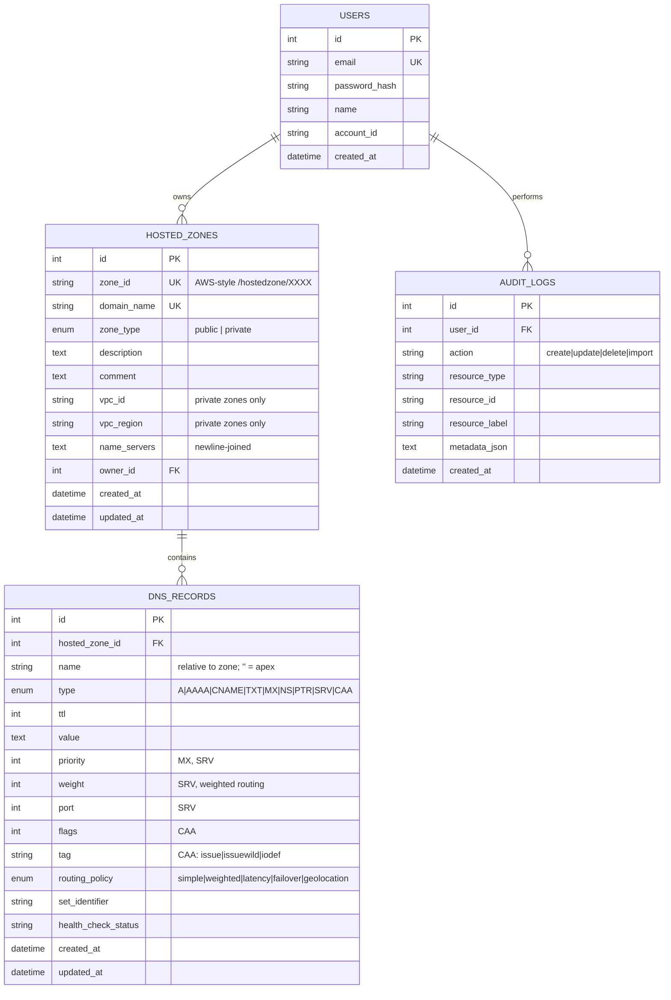

# Route 53 Console Clone

A production-quality, full-stack clone of the AWS Route 53 web console -- built as a technical assignment to demonstrate frontend engineering, backend architecture, database design, and product/UX polish.

> **Not affiliated with Amazon Web Services.** This is an educational clone with mocked authentication and no real DNS is served.

  

---

## Table of contents

1. [Overview](#overview)
2. [Features](#features)
3. [Tech stack](#tech-stack)
4. [Architecture](#architecture)
5. [Folder structure](#folder-structure)
6. [Database schema](#database-schema)
7. [API reference](#api-reference)
8. [Authentication / demo credentials](#authentication--demo-credentials)
9. [Local setup](#local-setup)
10. [Environment variables](#environment-variables)
11. [Running the backend](#running-the-backend)
12. [Running the frontend](#running-the-frontend)
13. [Running tests](#running-tests)
14. [Docker](#docker)
15. [BIND import](#bind-import)
16. [Export](#export)
17. [Keyboard shortcuts](#keyboard-shortcuts)
18. [Design decisions](#design-decisions)
19. [Known limitations / future improvements](#known-limitations--future-improvements)

---

## Overview

The app recreates the core Route 53 console experience:

- AWS-style global header (search, region selector, notifications, help, account menu) and collapsible service sidebar
- A Route 53 **Overview** dashboard with live stats and recent activity
- Full **Hosted Zones** CRUD with search, filtering, sorting, and pagination -- backed by real API queries, not client-side faking
- Full **DNS Records** CRUD for all 9 common record types (A, AAAA, CNAME, TXT, MX, NS, PTR, SRV, CAA), with a record-type-aware dynamic form
- **BIND zone file import** (upload -> parse -> preview -> confirm, with a per-record error report)
- **Export** to JSON or a BIND zone file
- **Dark mode**, **keyboard shortcuts**, and **bulk record selection/delete**
- Polished "Coming soon" pages for Traffic Policies, Health Checks, Resolver, and Profiles
- Mocked authentication with persistent sessions and protected routes

## Features

| Area | Status |
|---|---|
| Login / logout / persistent session | Done |
| Protected routes (server + client) | Done |
| Route 53 dashboard (stats, getting started, recent activity) | Done |
| Hosted zones: list / create / view / edit / delete | Done |
| Hosted zones: search, filter by type, sort, pagination | Done |
| Private hosted zones with mock VPC metadata | Done |
| DNS records: list / create / view / edit / delete | Done |
| DNS records: search, filter by type, sort, pagination | Done |
| Dynamic per-record-type form + client + server validation | Done |
| Confirmation dialogs for destructive actions | Done |
| Toast notifications, loading/empty/error states | Done |
| BIND zone file import (preview + confirm + summary) | Done |
| Export to JSON / BIND | Done |
| Dark mode (persisted) | Done |
| Keyboard shortcuts (`/`, `n`, `Esc`, `g h`, `g o`) | Done |
| Bulk record selection + bulk delete | Done |
| Coming Soon pages (Traffic Policies, Health Checks, Resolver, Profiles) | Done |
| Audit log of create/update/delete/import actions | Done |
| Automated tests (backend + frontend) | Done (43 backend, 33 frontend) |
| Docker Compose | Provided (see [limitations](#known-limitations--future-improvements)) |

## Tech stack

**Frontend:** Next.js 16 (App Router), React 19, TypeScript, Tailwind CSS v4, `lucide-react` icons.

**Backend:** FastAPI, Pydantic v2, SQLAlchemy 2.0 (ORM), SQLite, pytest.

**Auth:** Mocked -- PBKDF2-HMAC password hashing (stdlib `hashlib`, no native deps) + opaque HMAC-signed session tokens delivered as an `httpOnly` cookie. No real IAM/OAuth.

## Architecture

Both sides follow a layered, MVC-inspired architecture with a strict one-way dependency flow.

```mermaid
flowchart LR
    subgraph Frontend
        Pages["Pages / Routes (app/)"] --> Hooks["Feature hooks (features/*)"]
        Hooks --> Services["API client (services/api/*)"]
        Views["Reusable views (components/*)"] --> Pages
    end
    Services -- "fetch (same-origin, via Next.js rewrite)" --> Routes

    subgraph Backend
        Routes["API routes (api/routes/*)"] --> Controllers["Controllers (controllers/*)"]
        Controllers --> BizServices["Services (services/*)"]
        BizServices --> Repositories["Repositories (repositories/*)"]
        Repositories --> Models["Models (models/*)"]
        Models --> DB[(SQLite)]
    end
```



**Backend layering (strict):**

- **`api/routes/*`** -- FastAPI `APIRouter`s. Parse the request (path/query/body), call exactly one controller function, shape the HTTP response (status code, cookies, headers). No business logic.
- **`controllers/*`** -- Orchestrate one HTTP operation: call a service, commit the transaction on success, return a schema. This is the only layer allowed to call `db.commit()`.
- **`services/*`** -- All business logic and validation rules that go beyond what Pydantic can express (uniqueness checks, cross-field rules, name-server generation, BIND parsing orchestration, audit logging). Services raise typed domain exceptions (`app/core/exceptions.py`) instead of HTTP errors.
- **`repositories/*`** -- The only layer that touches the SQLAlchemy `Session` for queries. Encapsulates filtering/sorting/pagination SQL.
- **`models/*`** -- SQLAlchemy ORM entities and relationships.
- **`schemas/*`** -- Pydantic request/response contracts, decoupled from ORM models.

A single `app.exception_handler(AppError)` in `main.py` maps domain exceptions to HTTP status codes (404/409/422/401/413), so controllers never write `try/except` boilerplate for expected failure cases.

**Frontend layering (MVC-inspired):**

- **`app/*`** -- Route segments (pages/layouts only). Server components await `params`/`searchParams` and hand off to a client component; pages stay thin.
- **`features/<domain>/*`** -- The "controller" layer: hooks (`useHostedZonesList`, `useDnsRecordsList`) that own URL-synced filter/sort/page state and call the API layer, plus feature-specific modals/dialogs/tables that compose shared views.
- **`services/api/*`** -- A typed fetch client per resource (`hostedZones.ts`, `dnsRecords.ts`, ...) built on a shared `apiClient` that normalizes errors into a typed `ApiError`.
- **`types/*`** -- Shared TypeScript models mirroring the backend's Pydantic schemas.
- **`components/*`** -- Presentational, reusable views (`ui/`, `layout/`, `tables/`, `modals/`, `feedback/`) with no direct API calls.

No component fetches data or calls `fetch()` directly outside of `services/api/*`; no route function in the backend touches SQLAlchemy directly.

See [`docs/architecture.md`](docs/architecture.md) for request-lifecycle diagrams (auth flow, hosted zone CRUD, DNS record CRUD, import, export).

## Folder structure

```
.
├── backend/
│   └── app/
│       ├── main.py            # FastAPI app, CORS, exception handlers, router registration
│       ├── core/               # config, database engine/session, security (hashing/session tokens), exceptions
│       ├── models/             # SQLAlchemy models: User, HostedZone, DnsRecord, AuditLog
│       ├── schemas/             # Pydantic request/response contracts + validation
│       ├── repositories/       # Query layer (filtering, sorting, pagination)
│       ├── services/            # Business logic, BIND parsing/export, audit logging
│       ├── controllers/        # HTTP orchestration called by routes
│       ├── api/routes/          # FastAPI routers (thin)
│       ├── utils/                # BIND parser, name-server generator
│       └── seed.py               # Seed script (demo user + 5 zones + records + activity)
│   └── tests/                    # pytest suite (43 tests)
├── frontend/
│   └── src/
│       ├── app/                 # Next.js App Router pages/layouts
│       ├── features/            # Domain hooks + feature-specific components (auth, hosted-zones, dns-records, theme, shortcuts)
│       ├── components/          # Reusable UI (ui/, layout/, tables/, modals/, feedback/, route53/)
│       ├── services/api/        # Typed API client
│       ├── types/                # Shared TS types
│       ├── hooks/                 # Generic hooks (useAsyncData, useDebounce, useUrlParams, useKeyboardShortcut)
│       ├── constants/             # Nav config, DNS record field config
│       └── utils/                 # Formatters, class-name helper
├── docs/
│   └── architecture.md
├── docker-compose.yml
├── .env.example
└── README.md
```

## Database schema



**Indexes:** `hosted_zones.domain_name` (unique), `hosted_zones.zone_id` (unique), `dns_records(hosted_zone_id, name)` composite, `dns_records.type`, `dns_records.name`, `audit_logs(resource_type, resource_id)`, `audit_logs.created_at`.

**Cascading:** `dns_records.hosted_zone_id` has `ON DELETE CASCADE` (with SQLite `PRAGMA foreign_keys=ON` enabled per-connection so it's actually enforced) -- deleting a hosted zone deletes all of its records. `audit_logs.user_id` uses `ON DELETE SET NULL` so history survives user deletion.

## API reference

All routes are prefixed `/api`. Except `/api/auth/login` and `/api/health`, every route requires a valid session (cookie or `Authorization: Bearer <token>`).

| Method | Path | Description |
|---|---|---|
| POST | `/api/auth/login` | Authenticate, set session cookie |
| POST | `/api/auth/logout` | Clear session cookie |
| GET | `/api/auth/me` | Current user |
| GET | `/api/dashboard/summary` | Zone/record counts + recent activity |
| GET | `/api/hosted-zones` | List zones -- `search, zone_type, sort_by, sort_dir, page, page_size` |
| POST | `/api/hosted-zones` | Create a hosted zone |
| GET | `/api/hosted-zones/{id}` | Get one zone |
| PUT | `/api/hosted-zones/{id}` | Update description/comment |
| DELETE | `/api/hosted-zones/{id}` | Delete a zone (cascades to records) |
| GET | `/api/hosted-zones/{id}/records` | List records -- `search, type, sort_by, sort_dir, page, page_size` |
| POST | `/api/hosted-zones/{id}/records` | Create a record |
| GET/PUT/DELETE | `/api/hosted-zones/{id}/records/{record_id}` | Get / update / delete a record |
| POST | `/api/hosted-zones/{id}/records/bulk-delete` | Delete many records by id |
| POST | `/api/hosted-zones/{id}/import/preview` | Upload a BIND file, get a parsed preview |
| POST | `/api/hosted-zones/{id}/import/confirm` | Commit a previewed import |
| GET | `/api/hosted-zones/{id}/export?format=json\|bind` | Download a zone export |

List endpoints return `{ items, meta: { total, page, page_size, total_pages } }`.

Interactive Swagger docs are available at `http://localhost:8000/docs` once the backend is running.

## Authentication / demo credentials

```
Email:    admin@example.com
Password: Password123!
```

Authentication is intentionally mocked per the assignment scope: passwords are hashed with PBKDF2-HMAC and sessions are opaque, HMAC-signed tokens with a 12-hour expiry (see `backend/app/core/security.py`) -- there is no real IAM, OAuth, or MFA. The mock AWS account context (account ID `123456789012`, region "N. Virginia (us-east-1)") is fixed for the demo user.

## Local setup

Prerequisites: **Node.js 20+**, **Python 3.11+** (3.12 recommended for the widest prebuilt-wheel support), `pip`.

```bash
git clone <this-repo>
cd scaler-AWS
```

## Environment variables

Copy the example files:

```bash
cp backend/.env.example backend/.env
cp frontend/.env.example frontend/.env.local
```

| Variable | Where | Default | Purpose |
|---|---|---|---|
| `DATABASE_URL` | backend | `sqlite:///./route53.db` | SQLAlchemy connection string |
| `SESSION_SECRET_KEY` | backend | dev placeholder | HMAC key signing session tokens -- **change outside local dev** |
| `SESSION_TTL_SECONDS` | backend | `43200` (12h) | Session lifetime |
| `CORS_ORIGINS` | backend | `http://localhost:3000,http://127.0.0.1:3000` | Allowed CORS origins |
| `BACKEND_URL` | frontend | `http://127.0.0.1:8000` | Where Next.js proxies `/api/*` to (see `next.config.ts`) |

The frontend never calls the backend cross-origin from the browser: `next.config.ts` rewrites `/api/*` to `BACKEND_URL` server-side, so the browser only ever talks to `localhost:3000`, and the backend's `httpOnly` session cookie works without extra cross-site cookie configuration.

## Running the backend

```bash
cd backend
python -m venv .venv
source .venv/bin/activate        # Windows: .venv\Scripts\activate
pip install -r requirements.txt

python -m app.seed               # create + seed the SQLite database
uvicorn app.main:app --reload --port 8000
```

The API is now at `http://localhost:8000` (docs at `/docs`).

Re-run `python -m app.seed --reset` at any time to wipe and reseed the database.

## Running the frontend

```bash
cd frontend
npm install
npm run dev
```

Open `http://localhost:3000` -- you'll be redirected to `/login`.

## Running tests

**Backend** (43 tests -- auth, hosted zone CRUD, record CRUD + validation, search/filter/pagination, import, export, dashboard):

```bash
cd backend
python -m pytest -q
```

**Frontend** (33 tests -- record-type validation rules, formatters, `Button` component, `useDebounce` hook, login form validation + API error handling):

```bash
cd frontend
npm test
```

Also run before considering a change complete:

```bash
cd frontend
npx tsc --noEmit   # type check
npm run lint       # ESLint
npm run build      # production build
```

## Docker

A `docker-compose.yml` at the repo root builds both services:

```bash
docker compose up --build
```

- `backend` seeds its SQLite database (stored in a named volume) on first boot and serves the API on `:8000`.
- `frontend` builds a standalone Next.js server and serves on `:3000`, proxying `/api/*` to the `backend` service.

> **Note:** the Docker configuration was authored and reviewed but could not be build-tested in this environment (no running Docker daemon available at the time). If you hit an image-build issue, please open an issue -- the non-Docker setup above is fully verified.

## BIND import

From a hosted zone's detail page, click **Import**:

1. Upload a `.txt`/`.zone`/`.bind`/`.db` file (max 1 MB) containing standard BIND syntax (`$ORIGIN`, `$TTL`, `;` comments, and single-line records of the 9 supported types).
2. The backend parses every line and returns a **preview**: which lines parsed into a valid record, and which failed (with a reason) -- nothing is written yet.
3. Click **Import N record(s)** to commit. You get a **summary**: created / skipped (duplicates) / failed, with per-failure detail.

The parser lives in `backend/app/utils/parsers.py`; it purposefully does not support multi-line records with parentheses continuation.

## Export

From a hosted zone's detail page, use the **Export** menu:

- **JSON** -- the zone plus every record, in a structured format.
- **BIND zone file** -- a valid `$ORIGIN`/`$TTL` zone file including the mocked NS records, generated from the live database (not hardcoded).

Both are generated server-side (`backend/app/services/export_service.py`) from the same records you see in the table, and download via the browser's native file download.

## Keyboard shortcuts

| Shortcut | Action |
|---|---|
| `/` | Focus the search box on the current page |
| `n` | Open "Create hosted zone" / "Create record" (context-aware) |
| `Esc` | Close the open modal |
| `g` then `h` | Go to Hosted zones |
| `g` then `o` | Go to Route 53 overview |

Shortcuts are ignored while typing in an input/textarea/select (except `Esc`). See them any time via the header's **Help -> Keyboard shortcuts** menu.

## Design decisions

- **Session cookie + Next.js rewrite instead of CORS+JWT.** Proxying `/api/*` through Next.js means the browser only ever sees one origin, so the backend's `httpOnly` cookie behaves like a normal first-party cookie. Simpler and safer than juggling CORS + `SameSite=None` + token storage in `localStorage`.
- **PBKDF2 + opaque signed tokens instead of `bcrypt`/JWT libraries.** Avoids native-extension build issues across platforms while keeping the same "hashed password, signed expiring session" shape a real implementation would have. Clearly documented as mocked auth, per the assignment's scope.
- **Repository pattern even for a single-database app.** Keeps SQL/filtering logic out of services and controllers, and made it trivial to unit-test business rules (services) independent of query shape.
- **URL-synced list state (`useUrlParams`).** Search/filter/sort/page live in the query string, so hosted zone and record lists are shareable, bookmarkable, and survive a refresh or browser back/forward -- verified in this session.
- **In-memory staging for BIND import preview.** A two-step preview/confirm flow needs somewhere to hold parsed-but-uncommitted records between requests; for a single-process SQLite app, a short-lived in-memory map keyed by an opaque token is simpler than a database table and is documented as such in `bind_service.py`.
- **Tailwind v4 CSS variables layered under `@layer base`.** Cascade layers mean *unlayered* CSS always beats *layered* utility classes regardless of specificity -- base element resets (`a`, `body`, focus rings) are explicitly placed in `@layer base` so component utility classes (`text-white`, etc.) still win as expected.

## Known limitations / future improvements

- **Stateless session logout**: sessions are signed+expiring but not revocable server-side before expiry (no session table). Acceptable for a mock/demo login; a production version would add a session/blacklist table.
- **Docker Compose is authored but not build-verified** in this environment (no Docker daemon running here) -- the local (non-Docker) setup is the fully verified path.
- **Weighted/latency/failover routing policies** exist in the data model and are accepted by the API, but there is no dedicated UI for configuring them (out of scope per the assignment's DNS record form spec, which does not call for a routing-policy editor).
- **Single mock account/user** -- no multi-tenant account switching, matching the assignment's "mock AWS account context" scope.
