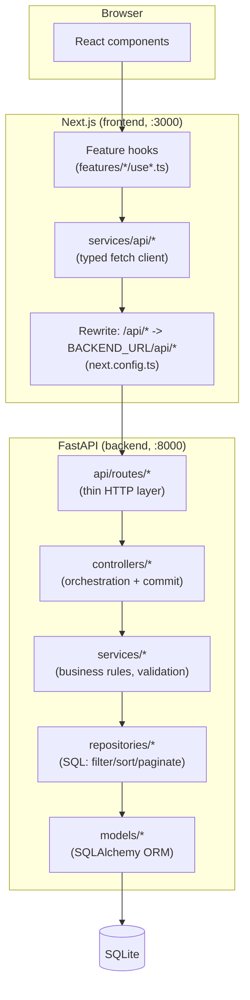
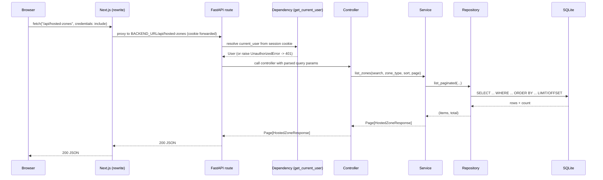
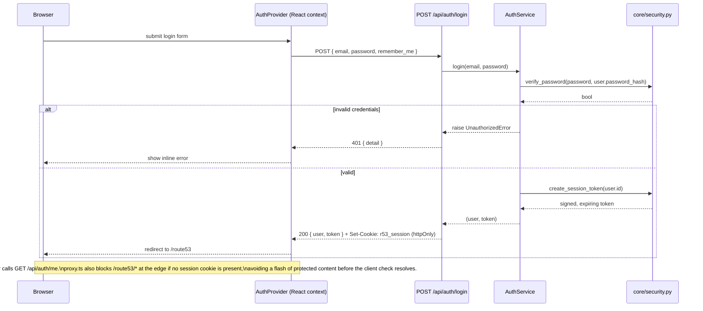
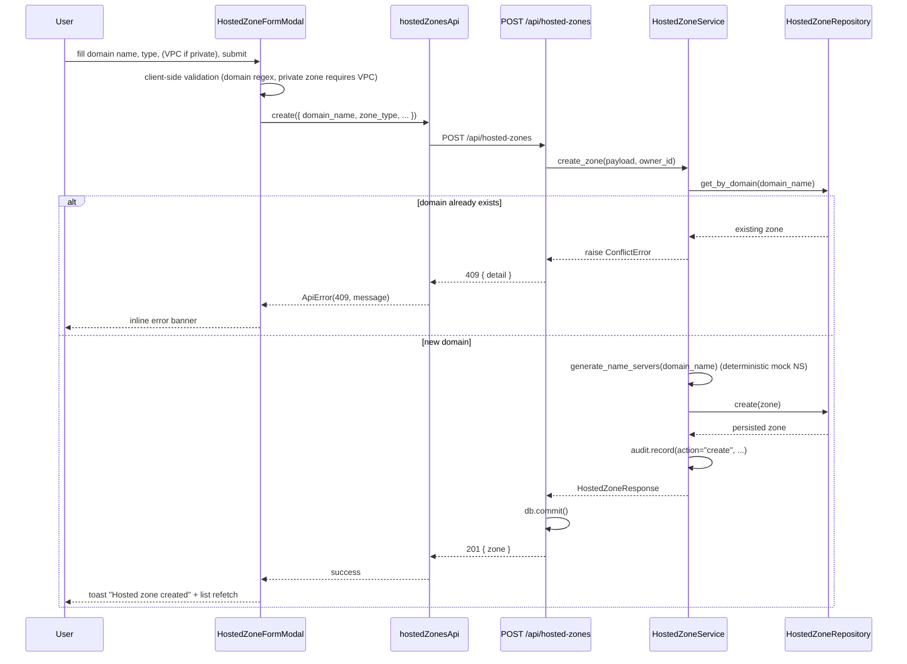
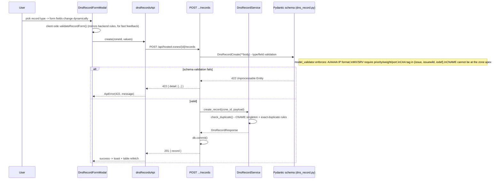
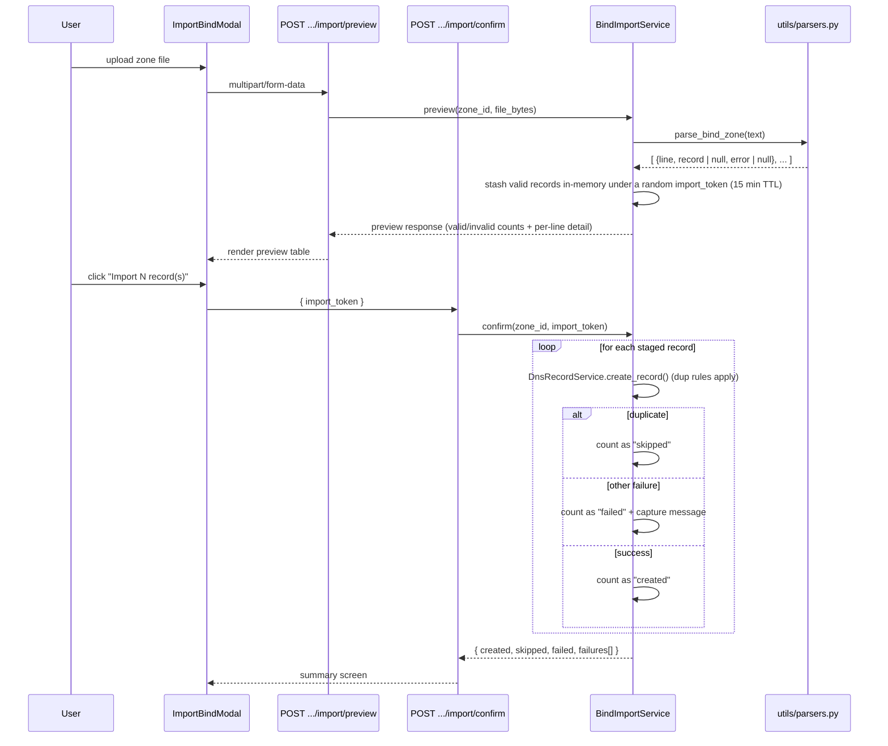
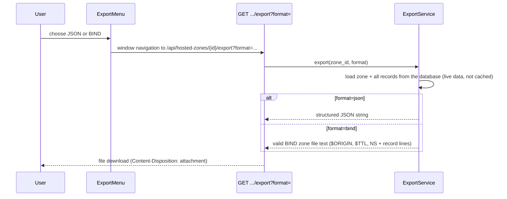
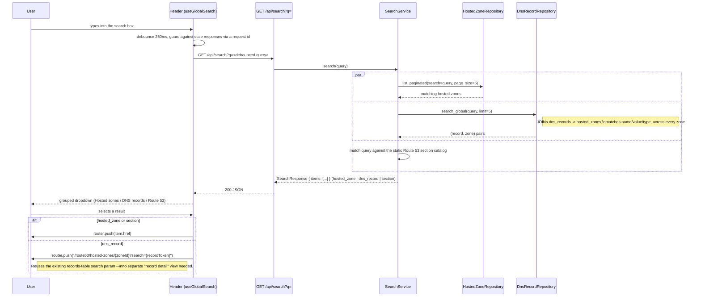

# Architecture

This document expands on the [root README](../README.md#architecture) with request-lifecycle diagrams for each major flow.

## Layered overview

Every write flows through exactly one controller function, which is the only place allowed to call `db.commit()`. Services never commit -- they raise a typed exception (`NotFoundError`, `ConflictError`, `ValidationError`, `UnauthorizedError`) on failure, which a single global FastAPI exception handler in `main.py` translates into the right HTTP status code. This keeps error handling out of every route function.

## Request lifecycle (any authenticated request)

## Authentication flow

Session tokens are **not** JWTs: they are `base64(payload).base64(HMAC-SHA256(payload))`, verified in `core/security.py` without any third-party crypto dependency (no `python-jose`, no `passlib`/`bcrypt`). This keeps the mock-auth dependency footprint at zero native packages -- which matters in practice on Python versions too new for a library's prebuilt wheels, where installing a native extension means compiling from source -- while preserving the same "signed + expiring" security shape a JWT would have.

## Hosted zone CRUD flow

Deleting a hosted zone relies on the database's `ON DELETE CASCADE` (SQLite `PRAGMA foreign_keys=ON` is enabled per-connection in `core/database.py`) to remove all of its `dns_records` atomically -- verified by `tests/test_hosted_zones.py::test_delete_zone_cascades_records`.

## DNS record CRUD flow

The frontend's `validateRecordForm` (in `features/dns-records/recordValidation.ts`) is a **UX convenience only** -- the backend's Pydantic validators in `schemas/dns_record.py` are the source of truth and are re-checked on every request regardless of what the client sent.

## BIND import flow

## Export flow

## Global search flow

The same `?search=` query param that powers the hosted zone's own record search box (`useDnsRecordsList`, URL-synced via `useUrlParams`) is what a DNS record search result deep-links into, so clicking a record result lands on its zone's page with the table already filtered to that record -- no bespoke navigation target was built just for search.
